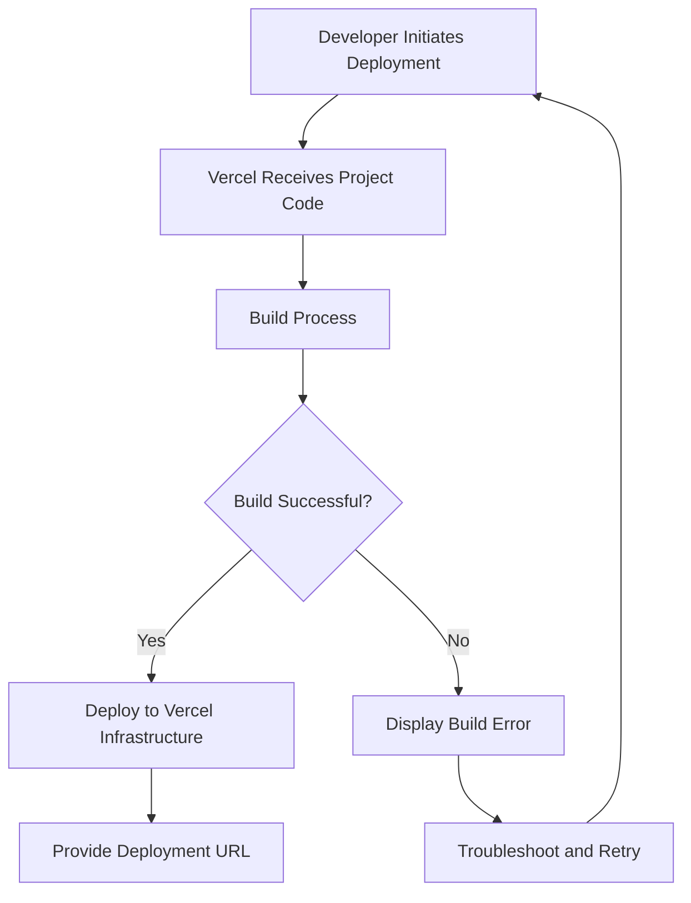

Relevant source files

The following file was used as context for generating this wiki page:

- [README.md](https://github.com/agattani123/vercel/blob/main/README.md)

# Deployment Process

## Introduction

The Vercel platform provides a streamlined deployment process for developers to build, preview, and ship their web applications. This wiki page focuses on the deployment process within the Vercel ecosystem, covering the various methods and steps involved in deploying projects to the Vercel platform.

Sources: [README.md](https://github.com/agattani123/vercel/blob/main/README.md)

## Deployment Methods

Vercel offers multiple ways to deploy projects to its platform. The following sections outline the different deployment methods and their respective workflows.

### Importing a Project

Developers can import an existing project to Vercel by following these steps:

1. Visit the [Vercel Import Project](https://vercel.com/new) page.
2. Connect the repository hosting the project (e.g., GitHub, GitLab, or Bitbucket).
3. Select the project repository from the list.
4. Configure the project settings (e.g., project name, build settings).
5. Click "Deploy" to initiate the deployment process.

After the deployment is complete, Vercel will provide a unique URL for accessing the deployed project.

Sources: [README.md:12](https://github.com/agattani123/vercel/blob/main/README.md#L12)

### Using Templates

Vercel offers a collection of pre-configured project templates that developers can use as a starting point for their applications. To deploy a project using a template, follow these steps:

1. Visit the [Vercel Templates](https://vercel.com/templates) page.
2. Browse and select the desired template.
3. Configure the project settings (e.g., project name, repository).
4. Click "Deploy" to initiate the deployment process.

After the deployment is complete, Vercel will provide a unique URL for accessing the deployed project based on the selected template.

Sources: [README.md:13](https://github.com/agattani123/vercel/blob/main/README.md#L13)

### Using the Vercel CLI

Vercel provides a command-line interface (CLI) that allows developers to deploy projects directly from their local development environment. To deploy using the Vercel CLI, follow these steps:

1. Install the Vercel CLI by following the [installation instructions](https://vercel.com/docs/cli).
2. Navigate to the project directory in your local environment.
3. Run the `vercel` command to initiate the deployment process.
4. Follow the prompts to configure the project settings (e.g., project name, build settings).
5. After the deployment is complete, Vercel will provide a unique URL for accessing the deployed project.

Sources: [README.md:14](https://github.com/agattani123/vercel/blob/main/README.md#L14)

### Git Integration

Vercel integrates with Git repositories, allowing developers to deploy their projects by simply pushing changes to the connected repository. To set up Git integration, follow these steps:

1. Import or create a new project on Vercel using one of the methods mentioned above.
2. Connect the project to a Git repository (e.g., GitHub, GitLab, or Bitbucket).
3. Configure the project settings (e.g., build settings, environment variables).
4. Make changes to the project locally and commit them to the connected Git repository.
5. Push the changes to the repository's remote branch.
6. Vercel will automatically detect the changes and initiate the deployment process.
7. After the deployment is complete, Vercel will provide a unique URL for accessing the deployed project.

Sources: [README.md:15](https://github.com/agattani123/vercel/blob/main/README.md#L15)

## Deployment Workflow

The deployment process on Vercel follows a consistent workflow, regardless of the deployment method used. Here's a high-level overview of the deployment workflow:

1. The developer initiates the deployment process using one of the methods mentioned above (importing a project, using a template, Vercel CLI, or Git integration).
2. Vercel receives the project code from the specified source (e.g., Git repository, local environment).
3. Vercel initiates the build process, which includes steps like installing dependencies, compiling code, and generating static assets.
4. If the build process is successful, Vercel deploys the project to its infrastructure.
5. If the build process fails, Vercel displays the build error for troubleshooting.
6. After a successful deployment, Vercel provides a unique URL for accessing the deployed project.
7. In case of a build failure, the developer can troubleshoot the issue, make necessary changes, and retry the deployment process.

Sources: [README.md](https://github.com/agattani123/vercel/blob/main/README.md)

## Deployment Configuration

Vercel allows developers to configure various aspects of the deployment process through project settings and configuration files. Some common configuration options include:

- **Build Settings**: Specify the build command, output directory, and other build-related settings.
- **Environment Variables**: Define environment variables for the project, which can be used during the build and runtime processes.
- **Deployment Regions**: Choose the geographic regions where the project should be deployed for optimal performance and latency.
- **Deployment Hooks**: Configure webhooks to trigger custom actions during the deployment process (e.g., sending notifications, updating third-party services).

Developers can configure these settings through the Vercel dashboard, the Vercel CLI, or by including configuration files (e.g., `vercel.json`) in their project repository.

Sources: [README.md](https://github.com/agattani123/vercel/blob/main/README.md)

## Conclusion

The deployment process on Vercel is designed to be simple and streamlined, allowing developers to focus on building their applications while Vercel handles the deployment and infrastructure management. By providing multiple deployment methods, configuration options, and a consistent workflow, Vercel aims to make the deployment process efficient and hassle-free for developers.