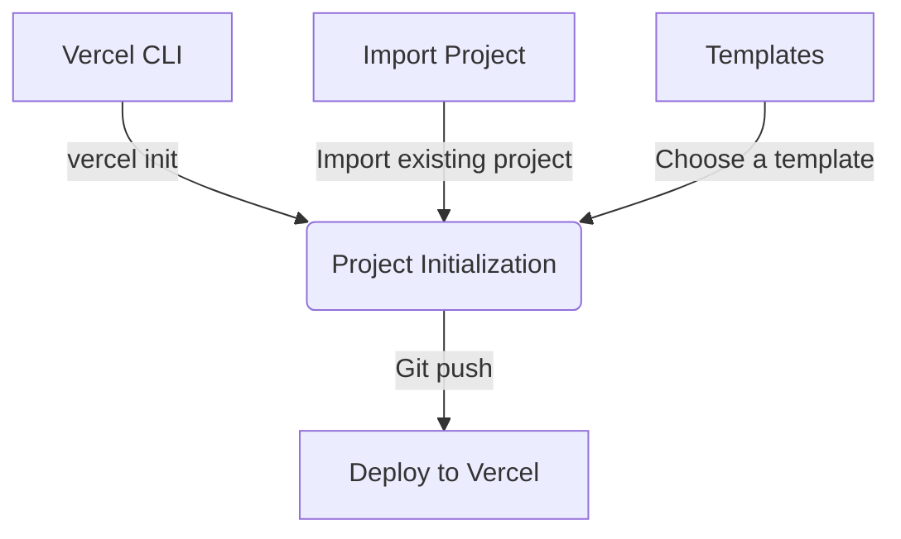
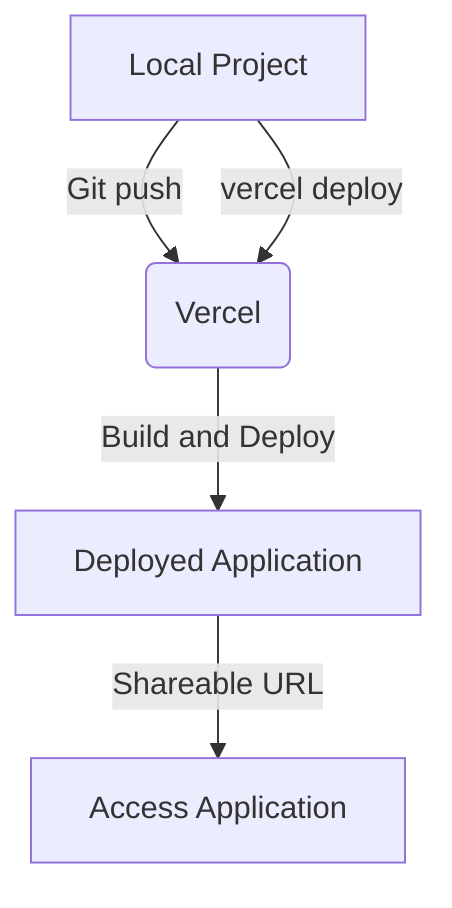
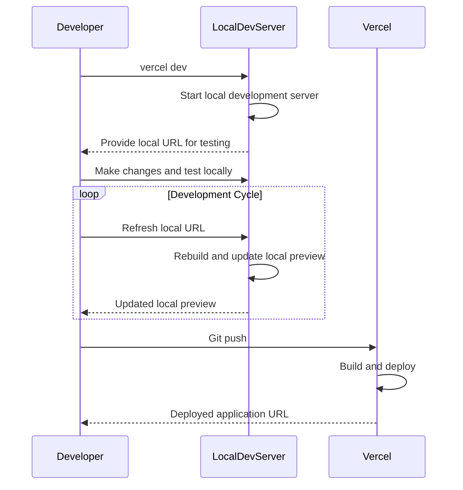

Relevant source files

The following files were used as context for generating this wiki page:

- [README.md](https://github.com/agattani123/vercel/blob/main/README.md)
- [examples/README.md](https://github.com/agattani123/vercel/blob/main/examples/README.md)
- [packages/cli/README.md](https://github.com/agattani123/vercel/blob/main/packages/cli/README.md)
- [packages/cli/src/commands/dev/dev.ts](https://github.com/agattani123/vercel/blob/main/packages/cli/src/commands/dev/dev.ts)
- [packages/cli/src/commands/dev/lib/dev-server.ts](https://github.com/agattani123/vercel/blob/main/packages/cli/src/commands/dev/lib/dev-server.ts)

# Getting Started

## Introduction

Vercel is a cloud platform that provides a developer experience and infrastructure for building, scaling, and securing web applications. The "Getting Started" process involves setting up a new project, deploying it to Vercel, and running it locally for development and testing purposes. This wiki page covers the key steps and components involved in getting started with Vercel, including project initialization, deployment, and local development.

Sources: [README.md](https://github.com/agattani123/vercel/blob/main/README.md), [examples/README.md](https://github.com/agattani123/vercel/blob/main/examples/README.md)

## Project Initialization

To create a new Vercel project, you can either import an existing project, choose a pre-built template, or use the Vercel CLI. The CLI provides a convenient way to initialize a new project from a variety of examples.

Sources: [README.md](https://github.com/agattani123/vercel/blob/main/README.md), [examples/README.md](https://github.com/agattani123/vercel/blob/main/examples/README.md)

## Deployment

After initializing a project, you can deploy it to Vercel with a single command using the Vercel CLI or by pushing your code to a Git repository connected to Vercel. The deployment process involves building your project and serving it on Vercel's infrastructure, providing you with a shareable URL.

Sources: [README.md](https://github.com/agattani123/vercel/blob/main/README.md), [examples/README.md](https://github.com/agattani123/vercel/blob/main/examples/README.md)

## Local Development

Vercel provides a local development environment using the `vercel dev` command, which allows you to test and preview your application locally before deploying it to the cloud. The local development server replicates the Vercel production environment, enabling you to catch and fix issues before deployment.

Sources: [packages/cli/README.md](https://github.com/agattani123/vercel/blob/main/packages/cli/README.md), [packages/cli/src/commands/dev/dev.ts](https://github.com/agattani123/vercel/blob/main/packages/cli/src/commands/dev/dev.ts), [packages/cli/src/commands/dev/lib/dev-server.ts](https://github.com/agattani123/vercel/blob/main/packages/cli/src/commands/dev/lib/dev-server.ts)

## Summary

Getting started with Vercel involves initializing a new project, deploying it to the Vercel cloud platform, and running it locally for development and testing purposes. The Vercel CLI provides a convenient way to manage these processes, allowing you to create projects from templates, deploy with a single command, and run a local development server that replicates the production environment. By following these steps, you can quickly set up and iterate on your web application, leveraging Vercel's infrastructure and developer experience.