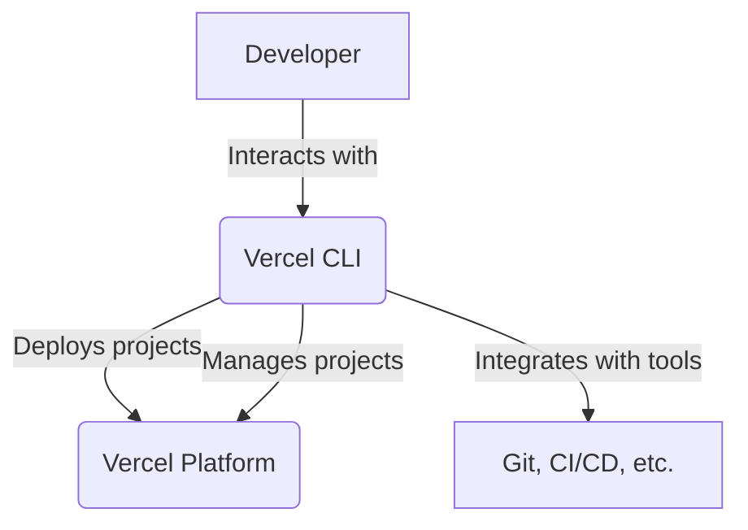
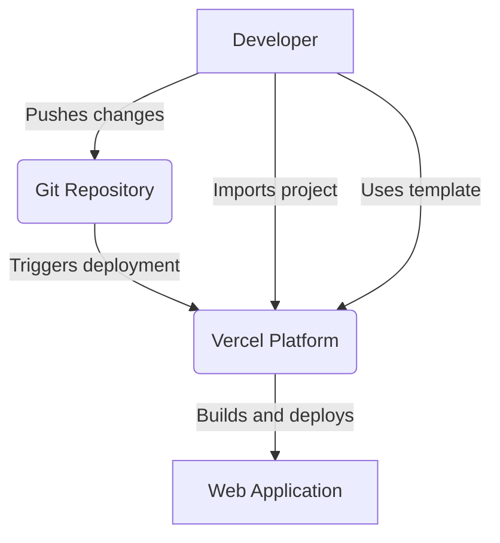
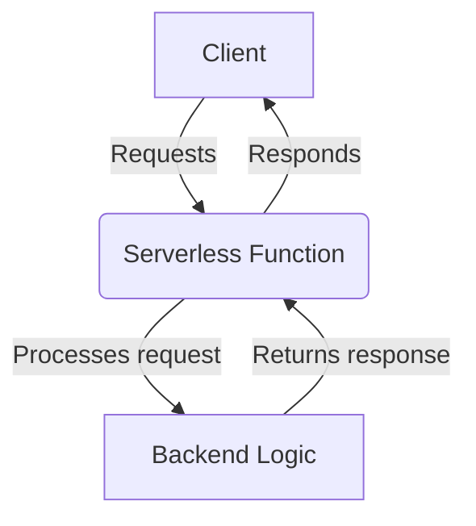
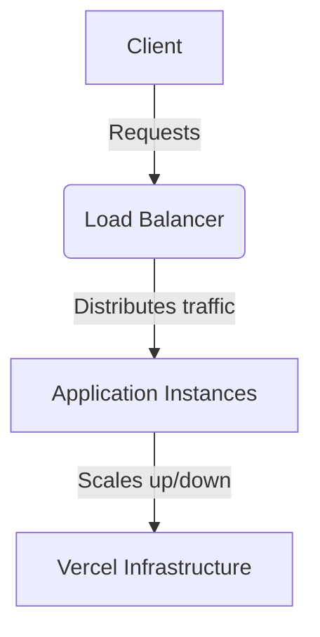
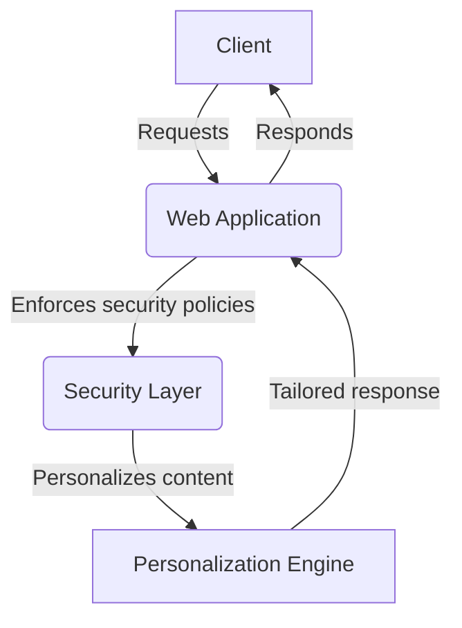

Relevant source files

The following file was used as context for generating this wiki page:

- [README.md](https://github.com/vercel/vercel/blob/main/README.md)

# System Architecture Overview

## Introduction

Vercel is a cloud platform that provides a developer experience and infrastructure for building, scaling, and securing faster and more personalized web applications. It offers a seamless workflow for deploying projects, leveraging features like Git integration, serverless functions, and automatic scaling. This overview aims to provide a high-level understanding of Vercel's system architecture, its key components, and their interactions.

## Core Components

### Vercel CLI

The Vercel CLI (Command Line Interface) is a crucial component that enables developers to interact with the Vercel platform directly from their local development environment. It allows for project deployment, management, and integration with various tools and services.

Sources: [README.md](https://github.com/vercel/vercel/blob/main/README.md#vercel-cli)

### Deployment Workflow

Vercel's deployment workflow is designed to be seamless and efficient, allowing developers to deploy their projects with minimal effort. The primary deployment methods include:

1. **Git Integration**: Developers can deploy their projects by pushing changes to a Git repository connected to Vercel.
2. **Importing Projects**: Vercel allows importing existing projects from various sources, such as GitHub, GitLab, or Bitbucket.
3. **Using Templates**: Vercel provides a collection of pre-configured project templates that developers can use as a starting point for their applications.

Sources: [README.md](https://github.com/vercel/vercel/blob/main/README.md#deploy)

### Serverless Functions

Vercel supports serverless functions, which allow developers to run backend code without provisioning or managing servers. These functions can be written in various languages and can be integrated with the frontend application or used as standalone APIs.

Sources: [README.md](https://github.com/vercel/vercel/blob/main/README.md#serverless-functions-implied)

### Automatic Scaling

Vercel's infrastructure is designed to automatically scale applications based on incoming traffic. This ensures that applications can handle high loads without manual intervention or provisioning additional resources.

Sources: [README.md](https://github.com/vercel/vercel/blob/main/README.md#automatic-scaling-implied)

### Security and Personalization

Vercel provides features for enhancing the security and personalization of web applications. This includes features like deployment protection, content security policies, and the ability to create personalized experiences based on user context.

Sources: [README.md](https://github.com/vercel/vercel/blob/main/README.md#security-and-personalization-implied)

## Conclusion

Vercel's system architecture is designed to provide a streamlined developer experience and a robust infrastructure for building, scaling, and securing web applications. Key components like the Vercel CLI, deployment workflow, serverless functions, automatic scaling, and security/personalization features work together to enable developers to focus on building their applications while leveraging the power and flexibility of the Vercel platform.